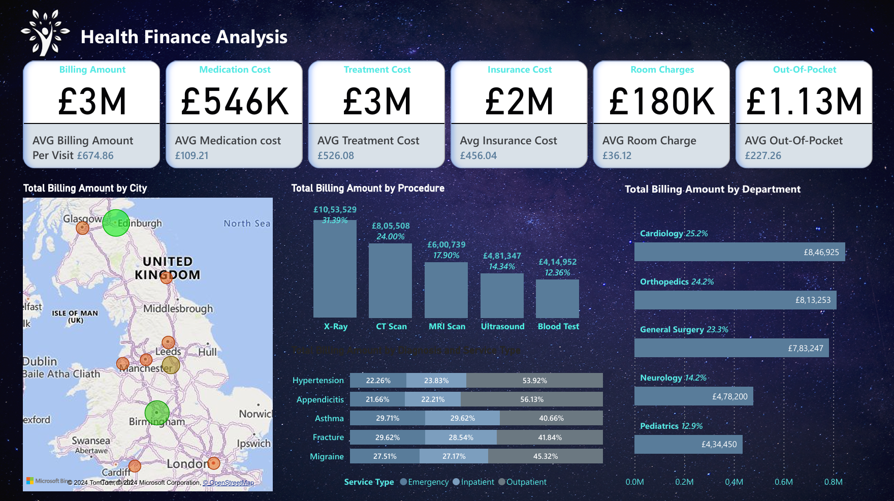

# Finance Analysis : Healthcare

## Overview

Detailed analysis covering all relevant aspects of the healthcare 
center's finance and the performance of healthcare 
providers.  
Dashboard is interactive and user-friendly, present the data in a clear and concise manner

## Key Metrics

- **Billing Amount:** £3M
  - **Average Billing Amount Per Visit:** £674.86
- **Medication Cost:** £546K
  - **Average Medication Cost:** £109.21
- **Treatment Cost:** £3M
  - **Average Treatment Cost:** £526.08
- **Insurance Cost:** £2M
  - **Average Insurance Cost:** £456.04
- **Room Charges:** £180K
  - **Average Room Charge:** £36.12
- **Out-Of-Pocket:** £1.13M
  - **Average Out-Of-Pocket:** £227.26

## Visualizations

### 1. Total Billing Amount by City

A map visualization showing the total billing amounts across various cities in the United Kingdom. Cities include Glasgow, Edinburgh, Leeds, Manchester, Birmingham, London, and others.

### 2. Total Billing Amount by Procedure

A bar chart displaying the total billing amounts for different medical procedures:
- X-Ray: £10,53,529 (31.39%)
- CT Scan: £8,05,508 (24.00%)
- MRI Scan: £6,00,739 (17.90%)
- Ultrasound: £4,81,347 (14.34%)
- Blood Test: £4,14,952 (12.36%)

### 3. Total Billing Amount by Department

A bar chart showing the total billing amounts by different hospital departments:
- Cardiology: £8,46,925 (25.2%)
- Orthopedics: £8,13,253 (24.2%)
- General Surgery: £7,83,247 (23.3%)
- Neurology: £4,78,200 (14.2%)
- Pediatrics: £4,34,450 (12.9%)

### 4. Total Billing Amount by Diagnosis and Service Type

A stacked bar chart illustrating the billing amounts by diagnosis (Hypertension, Appendicitis, Asthma, Fracture, Migraine) and service type (Emergency, Inpatient, Outpatient).

